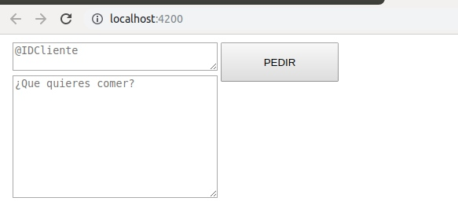
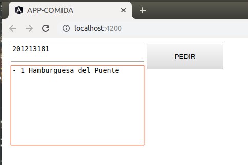
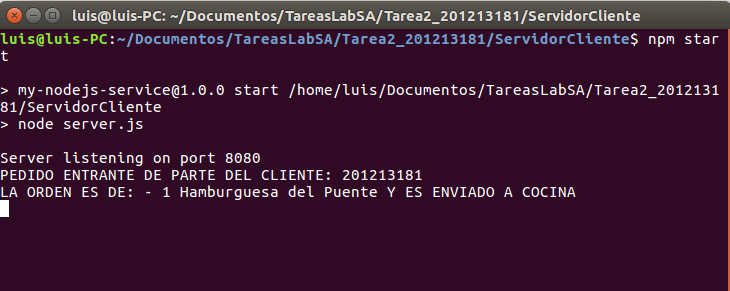
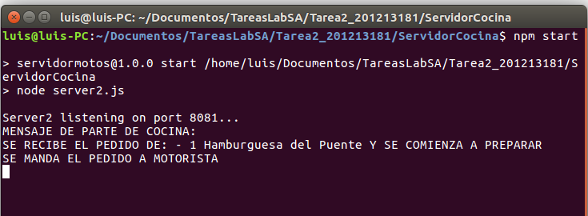
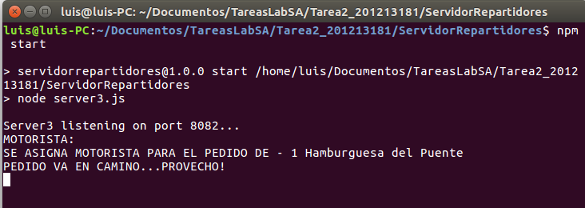

# SA_TAREA5_DEVOPS[2/2]

La tarea 5 consiste en tomar como base la tarea anterior y publicar los artefactos en **netlify**, para ello ahora se hizo la construccion de los artefactos con la herramienta **GULP**.

Para poder realizar esto se utilizaron dos funciones en el archivo gulp.js
  
    gulp.task('zip',function(){
    return gulp.src('./*')
       .pipe(zip('Tarea3_201213181.zip'))
       .pipe(gulp.dest('./ArtefactosFinales'));
    });

    gulp.task('fileindex',function(){
    return gulp.src('./ArtefactosFinales/*.zip')
       .pipe(fileindex())
       .pipe(gulp.dest('./ArtefactosFinales'));
    });

> La funcion **zip** toma como fuente los archivos en el directorio raiz y luego tiene como destino una carpeta llamada "ArtefactosFinales"

> La funcion **fileindex** toma el zip creado por la funcion anterior y en un archivo llamado "index.html" publica dicho zip.

Una vez hecho estos pasos se procede a ir a NETLIFY y configurar el sitio web para ver los artefactos claramente publicados. Los pasos a seguir para esto son:

1. Ingresar a https://www.netlify.com/
2. Ingresar con github
3. Seleccionar el repositorio
4. configurar el sitio web a desplegar
5. Para cada despliegue se debe de utilizar "gulp"
6. Desplegar el sitio web con la dirección proporcionada.
7. Descargar el artefacto desde el sitio web publicado.

# SA_Tarea3_201213181

La tarea 3 consiste en una pequeña orquestacion y simulación de servicios utilizando un ESB

Para poder llevar a cabo esta simulación se hicieron **3 servidores en Node.js**

>-Servicio web para cliente

>-Servicio web para restaurante

>-Servicio web para motorista

Para el web service del cliente se utilizo lo siguiente:

	const express = require('express');
	const port = 8080;
	const app = express();
	var cors = require('cors');

	const bodyParser = require('body-parser');
	const routes = require('./routes/routes');

	app.use(bodyParser.json());

	app.use(bodyParser.urlencoded({
    	extended: true,
	}));

	routes(app);

	const server = app.listen(port, (error) => {
    	if (error) return console.log(`Error: ${error}`);
 
    	console.log(`Server listening on port ${server.address().port}`);
	});

Las rutas utilizadas fueron de tipo ***POST***

Para poder recibir el pedido se utilizo: 

	app.post('/cliente', (request, response) => {
  	response.header("Access-Control-Allow-Origin","*");
  	response.header("Access-Control-Allow-Headers","Origin, X-Requested-With,Content-Type,Accept");
  	response.status(201).send(`Pedido realizado a cocina de: ${request.body.pedido}`);

  	axios.post('http://localhost:8081/cocina', {
    	pedido: request.body.pedido
  	})
  	.then(function (response) {
    	console.log(response);
  	})
  	.catch(function (error) {
    	console.log(error);
  	});
  	console.log("PEDIDO ENTRANTE DE PARTE DEL CLIENTE: "+ request.body.IDCliente);
  	console.log("LA ORDEN ES DE: "+request.body.pedido+" Y ES ENVIADO A COCINA");
	});	

Cabe destacar que se utilizo "Axios" para poder simular un cliente en el navegador, en este caso
al recibir el pedido por parte del cliente, este se envío a la cocina por medio de otra petición
**POST**

Finalmente la pequeña aplicacion hecha en Angular solo funciona como disparadora para los 3 servicios. 

Cuando se envia el pedido desde la aplicación, se puede ver el flujo en cada uno de los servicios, comenzando 
con el Web Service del cliente.

